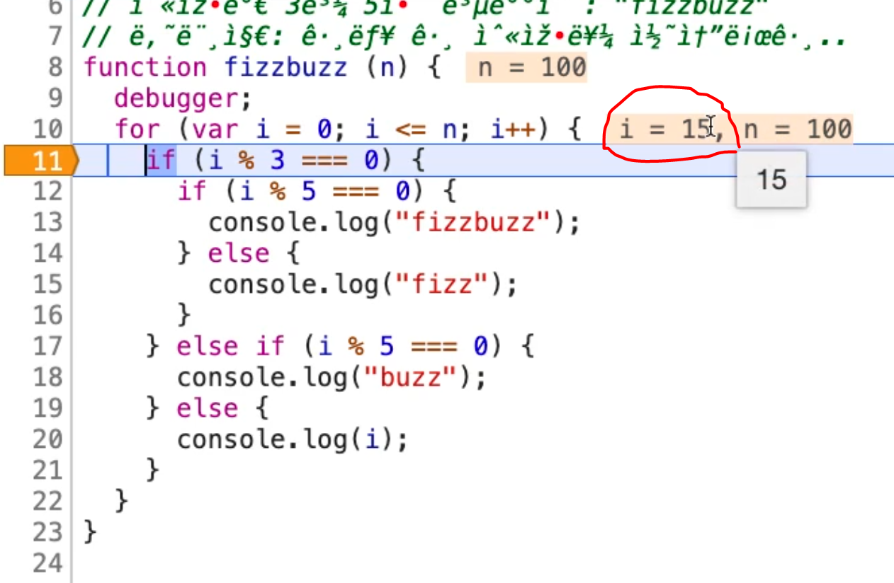

---
### Network
---
  

In developer tools, network menu displays the files that have been downloaded when loading a website. Files that have been loaded first will be on the top of the list. 

Clicking the file on the list will display a set of new tab menus: "headers","preview","response", and "timing". 

The response tab can be used to check the contents of the file.

---
### debugger ;
--- 


While developer tools window is open and if 'debugger;' expression executes inside a function, the code will stop running exactly where the debugger expression is located.  
If the developer tools window is not open,, the code will not stop running even if debugger expression is read.  
Since the code stops when the debugger expression is read, the debugger expression should be placed before the line of code that requires debugging.

---
### Resume 
---


Clicking on the resume button when the debugger expression has stopped the code will resume running the code. The code will only stop after pressing the resume button when there is another debugger expression in the code that is executed.  

If there is no debugger expression in the rest of the code, the code will run until the end of the file. 

---
### Step over
---


Clicking on the step over button when the debugger expression has stopped the code will run the next line of execution inside the function.  

---
### Mouseover on a variable
---


Bringing cursor over a variable will display its current value. This can be useful when there is a need to check the variable's value while debugging the code.

---
### Variables in local scope
---


On the righthand side of the debugger window, local variables and their values are shown under "scope".

---
### Add breakpoint 
---  


Clicking on the line number adds breakpoint which will stop the code when the code running resumes. The addition of breakpoint is noted as the blue block on the line which breakpoint is present.  

---
### Add conditional breakpoint  
---


Left-click on the line numbers adds a breakpoint to the file in debugger mode. However, right-click opens up a list of options available regarding breakpoint. Click on 'add conditional breakpoint'.

---    
  

This will open up a text input where conditions can be inserted. In this example, the breakpoint wl be addeild to stop the code when the variable i has the value of 15. Then press 'Enter' key to add the conditional breakpoint.

---


The conditional breakpoint will be noted as a orange block on the left-hand side. 

---


This is after the code running was resume. It is noticeable how the debugger stopped the code when the value of variable i is 15.  
This is how one would add conditional breakpoints using developer tools in debugger mode.

---
### HTML review
---

```html
<!DOCTYPE HTML>
  <html>
    <head>
      <title>Title of a webpage</title>
      <link rel="stylesheet" href="./main.css" />
    </head>
    <body>

      <script src="./index.js"></script>
    </body>
  </html>
```

Try to write this basic structure of HTML which loads CSS and JS file without any aid! It can be trickier than you think... 
