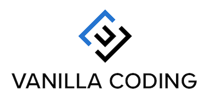

---
#### Q : 바닐라코팅? 그게 뭐죠. 먹는거 아닌가요?  
---
A: 아, 하하 바닐라 코팅이 아니고 바닐라'코딩' 입니다.  바닐라코딩은 세계적인 수준의 웹개발 교육을 받을 수 있는 곳이에요. 미국에서 프론트엔지니어로 활동 하시다 한국에 오셔서 재능기부를 하고 계신 Ken Huh님이 운영을 맡고 있어요. Ken님은 대표적으로 Nike, Vimeo, Barns&Noble, Sears, 등 미국의 여러 빅네임 컴퍼니에서 일을 하셨고 많은 회사로부터 러브콜을 받으신 실력자에요. Ken님이 바닐라코딩에서 직접 강의를 맡으시고 경쟁력있는 개발자 양성에 힘쓰고 계시죠.  
제가 알기론 2017년 가을부터 시작하셔서 2019년 4월까지 총 5기의 수료생들이 있었고 현재는 6기를 모집하기 위한 준비를 하고 계세요. 바닐라코딩 수료생들은 국내뿐만 아니라 해외에서도 프론트엔지니어로 활동한다고 해요. 저는 현재 부트캠프 6기에 합류하기 위해 기초과정인 '부트캠프 프렙' 과정 3주차에 있어요.  
바닐라코딩은 이처럼 '웹프로그래밍에 관해 자유롭게 배울수 있는 곳' 이기도 하지만, 제 생각엔 바닐라코딩은 수료생들과 바닐라코딩과 인연이 있는 사람들로 이루어진 커뮤니티를 뜻하기도 해요. 그 이유는 바닐라코딩에서는 부트캠프를 마친 수료생은 과정이 끝난 후에도 언제든 바닐라코딩에 환영하기 때문이에요. 와서 개발을 하거나, 다른 기수의 수료생들과 교류도 하고, 혹은 현재 수강생들에게 멘토 역할도 하며 끈끈한 커뮤니티를 형성하고 있어요. 수업이 있었던 이번 수요일이 마침 스승의 날이어서 수료생들이 찾아와 Ken님께 감사도 드리고, 같이 맛있는 케잌도 먹고, 바닐라코딩 커뮤니티를 느낄 수 있었던 시간이었죠. 

<!-- ---
#### Q : 다른 곳도 많은데 어째서 바닐라코딩을 선택했나요? 
---

    (바닐라코딩의 장점들: 켄님, 교육의 퀄리티 (재미와 양질의 교육)
    , 커뮤니티, 서포트 (구글 for 스타트업 컨퍼런스)) -->

---
#### Q : 바닐라코딩에선 무엇을 배울 수 있는지?  
---
    (자바스크립트,HTML,CSS 그리고 backend ... 전반적인 웹 프로그래밍에 관한 지식과 경험)

---
#### _**Q :**_ 바닐라 코딩의 수업 분위기는? 
---
    a
---
#### _**Q :**_ 나에게 바닐라 코딩이란?
---
    s
---
#### _**Q :**_ 어떻게 바닐라 코딩에 기여할 계획인지?
---
    d
---
#### _**Q :**_ 마지막으로 한마디: 
---
    f

  

| [homepage](https://www.vanillacoding.co/) | [blog](https://medium.com/vanilla-coding) | [facebook](https://www.facebook.com/vcoding/) |  [instagram](https://www.instagram.com/vanilla_coding/)  |